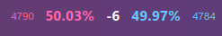

# arewelazeryet-plasmoid

A KDE Plasma widget for displaying:
1. The current online users in osu!(lazer) and osu!(stable)
2. The user share percentage of the clients
3. The delta of online users between the clients

Preview:

## Setup
1. Clone the repository
2. Navigate into the repository folder
3. Run `kpackagetool6 --type Plasma/Applet --install .`
